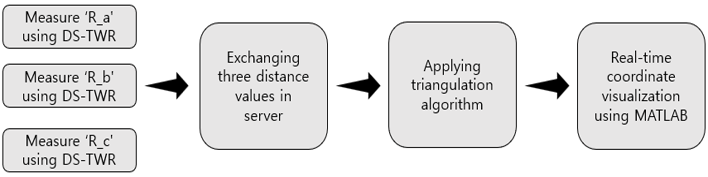
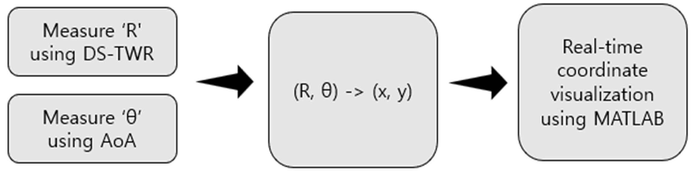
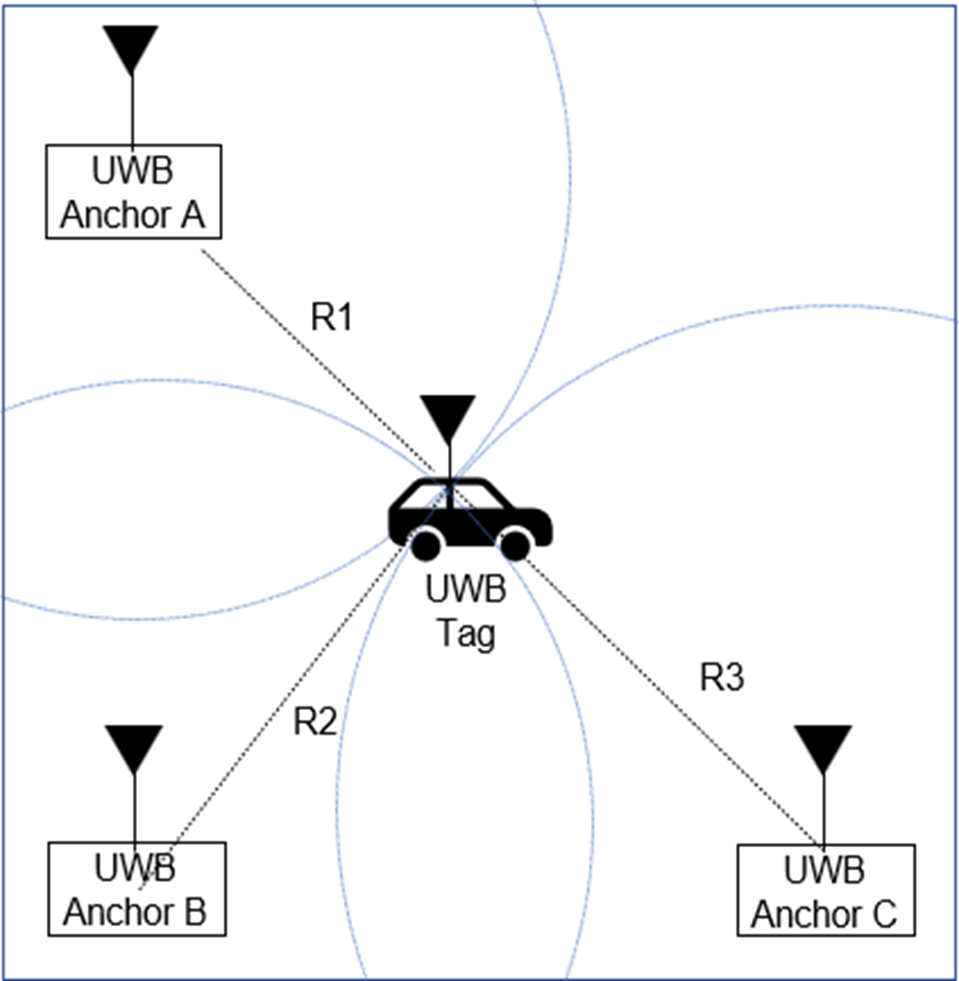
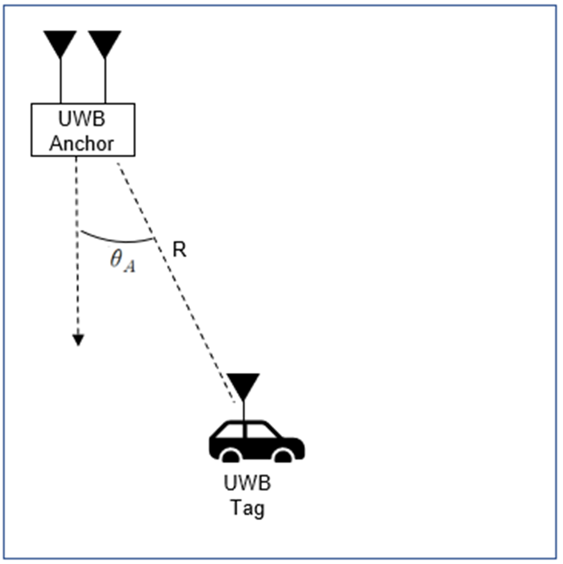
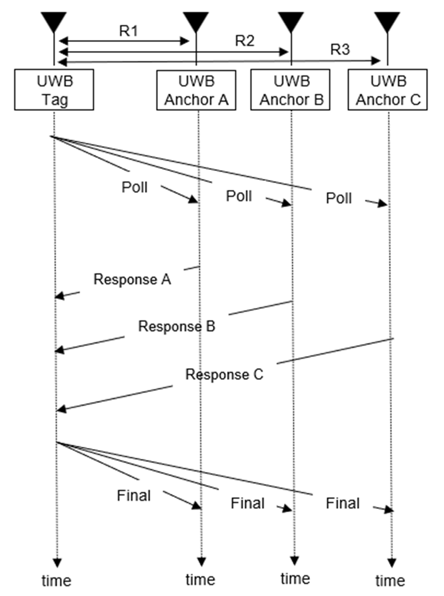
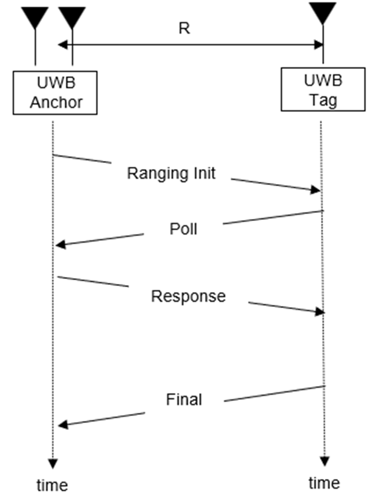
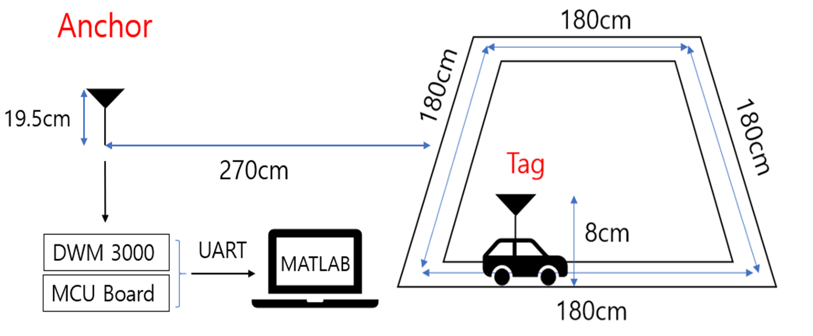

# AoA-Based UWB RTLS

> **Single Anchor + Single Tag 실시간 위치 추적 시스템**  
> DS-TWR 기반 거리(Ranging)와 AoA(Angle of Arrival) 기반 각도(Angle Estimation)를 융합해 **저복잡도·실시간 RTLS**를 구현

---

## 1. 개요
**단일 앵커(Anchor)**와 **단일 태그(Tag)** 만으로 실시간 위치 추적(Real-Time Locating System, RTLS)을 구현하는 프로젝트입니다.  
기존 삼각측량 방식이 최소 3개 이상의 앵커를 요구하는 것과 달리, **AoA(Angle of Arrival)**를 도입해 **앵커 수를 줄이고 시스템 구조를 단순화**했습니다.

**기존 삼각측위법 process**

  <!-- 시스템 개요도 -->
  

**AoA RTLS process**

  <!-- 시스템 개요도 -->
  

**기존 삼각측위법 RTLS와 AoA RTLS 비교**

## 시스템 및 신호 흐름 비교

  <!-- 첫 번째 줄 : 기존 삼각측량 RTLS vs AoA RTLS 비교 -->
  
  

  <!-- 두 번째 줄 : RTLS 신호 과정 -->
  
  

---

## 2. 핵심 기술 및 구현 방식
- **거리 측정 (Ranging)**  
  - DS-TWR(Double-Sided Two-Way Ranging)을 사용하여 태그와 앵커 간의 정밀한 거리(R) 계산
- **각도 측정 (Angle Estimation)**  
  - UWB 안테나 배열의 위상차(Phase Difference) 기반 AoA 계산
- **위치 추정**  
  - 거리 R과 각도 θ를 결합하여 2D 좌표를 실시간 산출
- **표준**: IEEE 802.15.4z HRP UWB
- **안테나**: XR-170 UWB 지향성 안테나

  <!-- AoA/DS-TWR 이론 및 신호 흐름 -->
  

---

## 3. 시스템 구성 및 실험 환경
- **하드웨어**
  - Anchor: nRF52840 + DW3110 UWB 모듈
  - Tag: nRF52840 + DW3110
  - 안테나: XR-170 Directional Antenna
- **소프트웨어**
  - 임베디드 C 기반 DS-TWR 및 AoA 계산
  - MATLAB을 활용한 실시간 데이터 시각화

  <!-- 실험 환경 및 배치 -->
  

---

## 4. 주요 성과 및 분석
### ✅ 성과
- **단일 앵커 + 태그 구성**으로 DS-TWR + AoA 융합 실시간 RTLS 구현
- 실험 환경에서 **cm 단위 수준의 위치 추적 정확도** 확보
- MATLAB 기반 실시간 시각화 성공

### ⚠️ 문제점 및 해결
- **Y축 오차**
  - Y축 이동 시 각도 변화폭이 작아 X좌표 분산이 집중되는 현상
  - → 칼만 필터(Kalman Filter) 등 가중치 기반 필터 적용으로 정확도 향상 가능
- **실시간 시각화 문제**
  - MATLAB UART 통신 시 데이터 누락 → 버퍼 주기적 초기화로 해결

  <!-- 실험 결과 그래프 -->
  

---

## 5. 개선 방향
- 이동 방향 기반 **보정 로직** 추가로 안정적 추적
- 앵커 배치 최적화 및 보조 신호 활용으로 Y축 오차 감소
- 실시간 필터링(EKF, UKF) 적용으로 잡음 및 지터 완화

---

## 6. 데모 영상

---

## 7. 수상
🏆 **한국 전자파 학회 제 4회 대학생 창의설계 경진대회 동상 수상**

---

